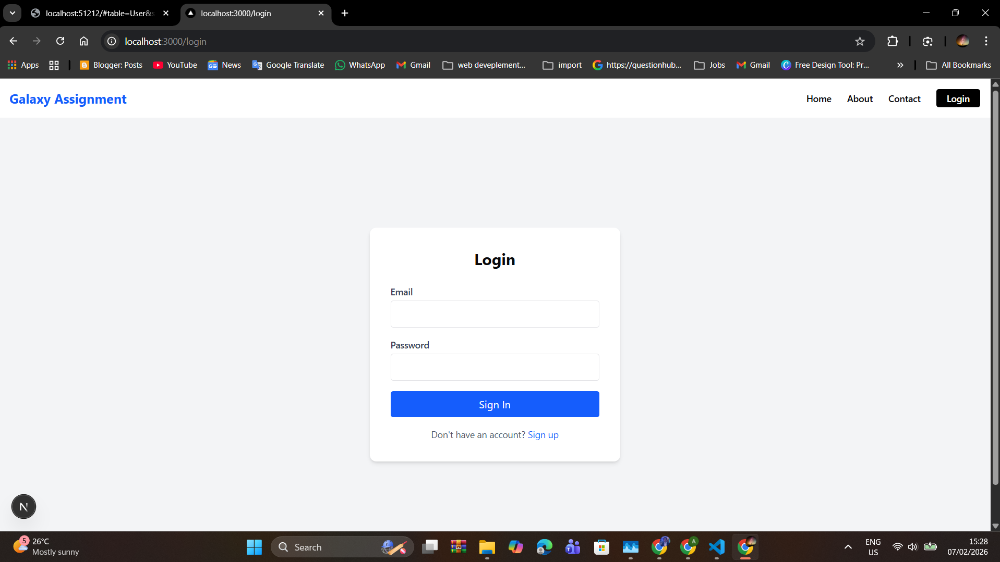
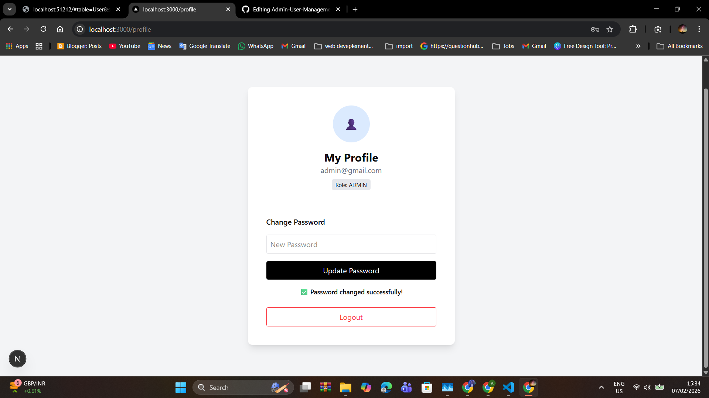
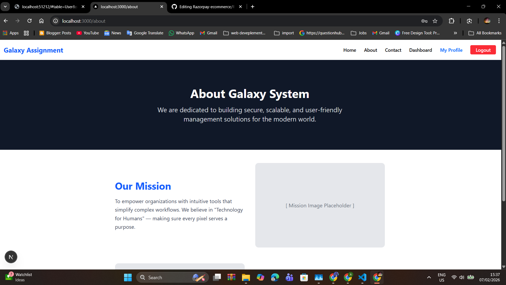
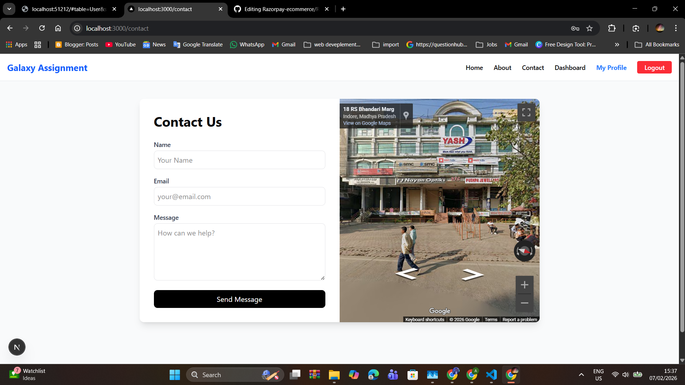
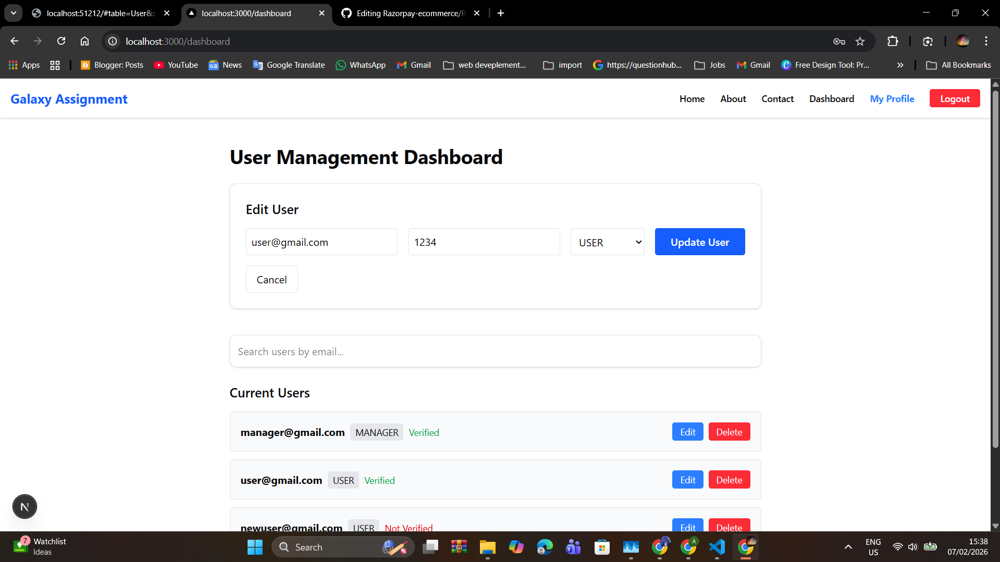
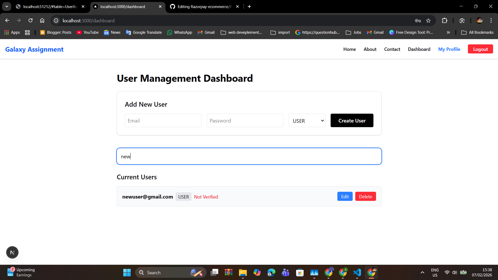
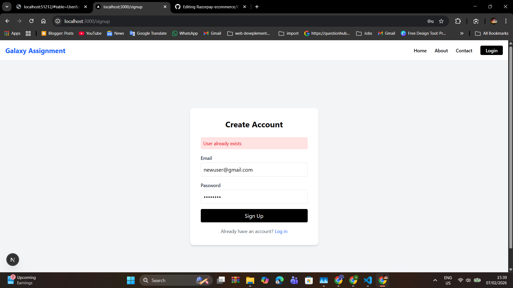
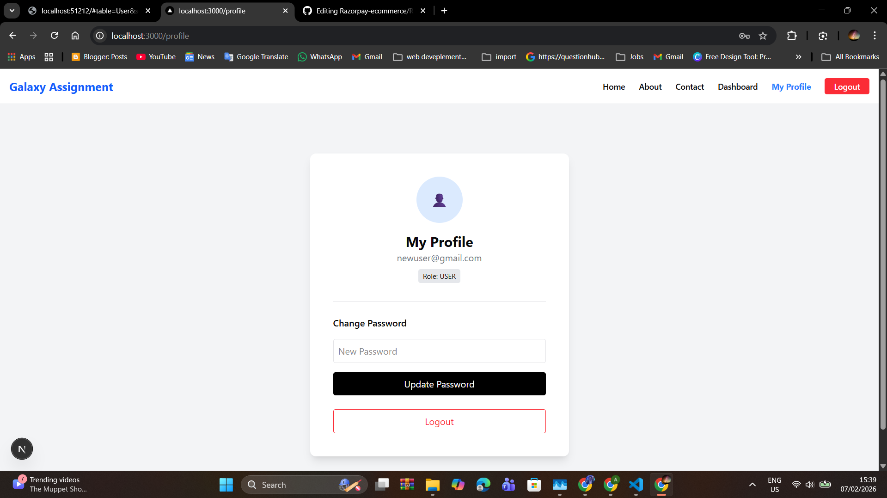
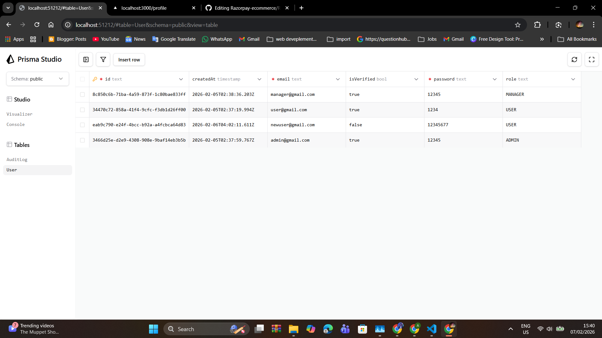

# 🌌 Galaxy System - Full Stack User Management

A modern, secure, and responsive User Management application built with **Next.js**, **Tailwind CSS**, and **PostgreSQL**. This project demonstrates a complete Full-Stack workflow, including authentication, database management, and role-based access control.

---

## 🚀 Key Features

- **Authentication & Security**: Complete Sign-up and Login flow with role-based redirection.
- **Admin Dashboard**: Full CRUD (Create, Read, Update, Delete) functionality to manage users in real-time.
- **Smart Search**: Module-specific search bar to filter users by email instantly.
- **User Profile**: Private profile page for users to manage their details and change passwords.
- **Protected Routes**: Security logic that prevents unauthorized users from accessing the Admin Dashboard.
- **Public Pages**: Professional Landing page, About Us, and a Contact page featuring Google Maps integration.

---

## 📸 Screenshots

### 🖥️ Admin Dashboard


_Managing users with the CRUD interface and search functionality._

### 🔑 Login & Security


_Secure authentication with automated role redirection._

### 👤 User Profile


_Personalized user area for account management._

---

## 🛠️ Tech Stack

- **Frontend**: Next.js (App Router), Tailwind CSS
- **Backend**: Next.js API Routes
- **Database**: PostgreSQL (Hosted on Neon.tech)
- **ORM**: Prisma
- **Deployment**: Vercel

---

## 🏗️ Project Architecture

Unlike standard React apps that rely on a manual `App.jsx`, this project utilizes the **Next.js File-Based Routing** system.

- **`app/layout.tsx`**: Acts as the global frame, holding the Navigation Bar constant across all routes.
- **`app/api/`**: Handles server-side logic and direct communication with the PostgreSQL database via Prisma.
- **`lib/prisma.ts`**: A singleton pattern for the Prisma Client to ensure efficient database connections.



---

## ⚙️ Installation & Setup

1. **Clone the repository**:

   ```bash
   git clone [https://github.com/NikhilKhare973/galaxy-assignment.git](https://github.com/NikhilKhare973/galaxy-assignment.git)

   ```

2. **Install dependencies:**:

   ```bash
   npm install

   ```

3. **Clone the repository**: Create a .env file and add your Neon Database URL:

   ```bash
   DATABASE_URL="your_postgresql_connection_string"

   ```

4. **Sync the Database**:

   ```bash
   npx prisma db push

   ```

5. **Run the development server**:
   ```bash
    npm run dev
   ```

---


# 👨‍💻 About the Developer

I am Nikhil Khare, a recent software engineering graduate passionate about building scalable web applications. My focus is on creating intuitive user experiences backed by robust server-side logic.

- LinkedIn: https://www.linkedin.com/in/nikhilkhare973/



This is a [Next.js](https://nextjs.org) project bootstrapped with [`create-next-app`](https://nextjs.org/docs/app/api-reference/cli/create-next-app).

## Getting Started

First, run the development server:

```bash
npm run dev
# or
yarn dev
# or
pnpm dev
# or
bun dev
```




Open [http://localhost:3000](http://localhost:3000) with your browser to see the result.

You can start editing the page by modifying `app/page.tsx`. The page auto-updates as you edit the file.

This project uses [`next/font`](https://nextjs.org/docs/app/building-your-application/optimizing/fonts) to automatically optimize and load [Geist](https://vercel.com/font), a new font family for Vercel.

## Learn More

To learn more about Next.js, take a look at the following resources:

- [Next.js Documentation](https://nextjs.org/docs) - learn about Next.js features and API.
- [Learn Next.js](https://nextjs.org/learn) - an interactive Next.js tutorial.

You can check out [the Next.js GitHub repository](https://github.com/vercel/next.js) - your feedback and contributions are welcome!





## Deploy on Vercel

The easiest way to deploy your Next.js app is to use the [Vercel Platform](https://vercel.com/new?utm_medium=default-template&filter=next.js&utm_source=create-next-app&utm_campaign=create-next-app-readme) from the creators of Next.js.

Check out our [Next.js deployment documentation](https://nextjs.org/docs/app/building-your-application/deploying) for more details.



